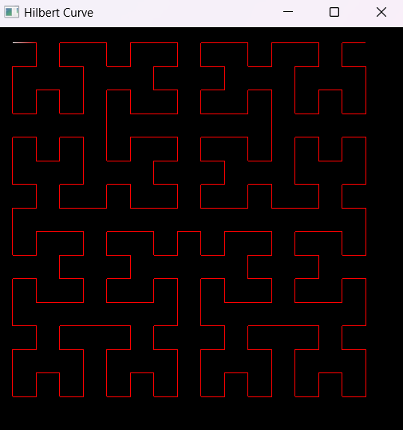
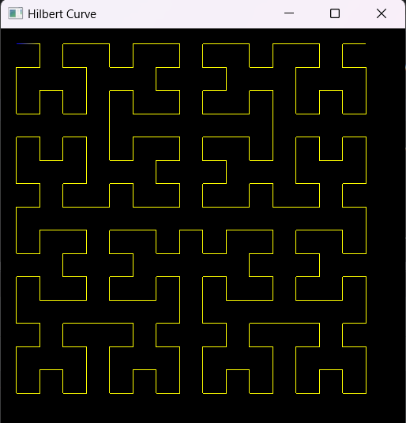
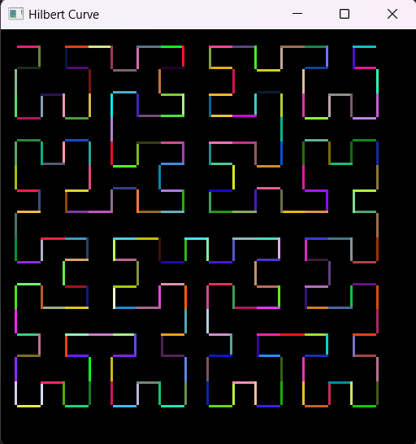

## Hilbert Curve Visualization

This project visualizes a 2D Hilbert Curve using SFML. The Hilbert Curve is a space-filling curve that visits every point in a square grid with a continuous path. This implementation provides a graphical representation of the curve and allows for visual inspection of its properties.

### Files

- **main.cpp**: The entry point of the program. It sets up the SFML window, generates the Hilbert Curve, and handles the rendering loop.
- **HilbertCurve.hpp**: Header file that defines the `HilbertCurve` class. This class is responsible for generating the points of the Hilbert Curve.
- **HilbertCurve.cpp**: Implementation file for the `HilbertCurve` class. It includes the logic for generating the Hilbert Curve and handling rotations.

### Installation

#### Prerequisites

- **SFML**: You need to have SFML installed. Follow the instructions on the [SFML website](https://www.sfml-dev.org/download.php) to install it for your platform.

#### Building the Project

1. **Clone the repository**:

    ```sh
    git clone https://github.com/xcodeBn/HilbertCurveCpp.git
    cd HilbertCurveCpp
    ```

2. **Compile the code**:

    - If you're using CMake:

        ```sh
        mkdir build
        cd build
        cmake ..
        cmake --build .
        ```

    - If you're using a Makefile:

        ```sh
        make
        ```

3. **Run the executable**:

    - If you're using CMake:

        ```sh
        ./HilbertCurveVisualization
        ```

    - If you're using a Makefile:

        ```sh
        ./hilbertCurve
        ```

### Hilbert Curve

The Hilbert Curve is a type of space-filling curve that was first described by the German mathematician David Hilbert in 1891. It is a continuous fractal curve that can fill an entire 2D space, and it has several interesting properties and applications, especially in the field of computer science.

#### Algorithm

The algorithm used to generate the Hilbert Curve involves recursive partitioning of the 2D space and careful rotation and reflection of coordinates. The curve is defined for any positive integer order `n`, where the grid size is `2^n x 2^n`. The basic steps of the algorithm are:

1. **Initialization**: Start with the smallest square (1x1).
2. **Recursive Construction**: Divide each square into four smaller squares and connect them in a specific order.
3. **Rotation and Reflection**: Rotate and reflect the smaller squares to ensure the curve is continuous and space-filling.

#### Example

For an order of `n=2`, the Hilbert Curve traverses a 4x4 grid in a specific path that visits every point exactly once.

### Screen Shots









### Notes

- Adjust the `order`, `width`, `height`, and `padding` parameters in the `main.cpp` file to customize the visualization.
- The code highlights rotation phases by changing the color of the segments during rotation.

### License

This project is licensed under the MIT License. See the [LICENSE](LICENSE.txt) file for details.
